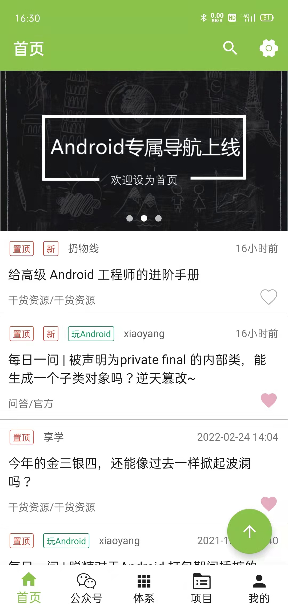
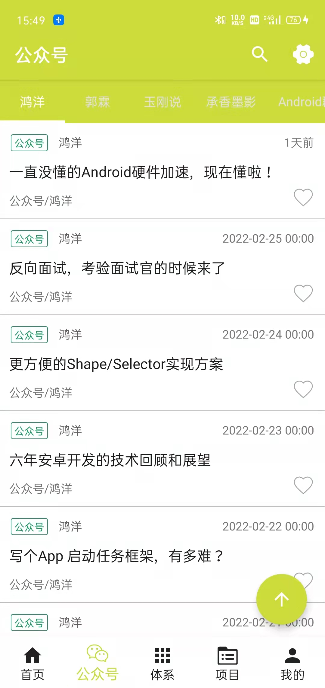
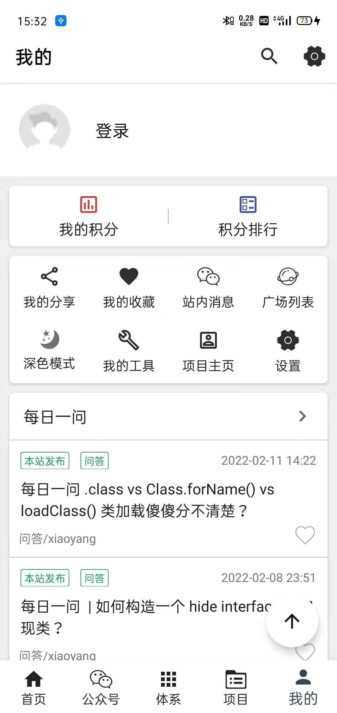
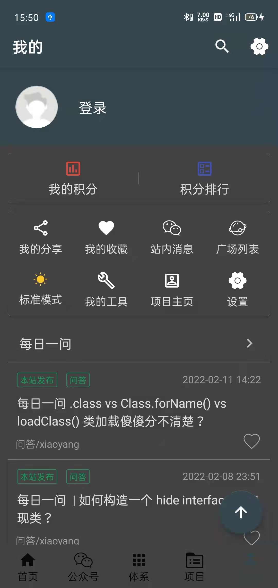

#### 一个Kotlin + 协程 + MVVM 的wanandroid项目
- **Kotlin语言编程，协程和MVVM架构**
- **下载导入本地aar包，gradle插件管理版本**
- **SplashScreenApp启动画面**
- **随意切换主题颜色，适配深色模式**
#### 效果图展示 






 #### APK下载：
- [Github下载](https://raw.githubusercontent.com/xiaobinAndroid421726260/KotlinMvvmWanAndroid/master/app/publish/release/app-publish-release.apk)

## 以下开源库，我有一部分是下载成aar包的形式集成在项目中，有需要的可以根据[这里下载](https://mvnrepository.com/)
```
// 头条适配
implementation project(path: ':LocalPackage:AutoSize_aar')
// Banner
implementation project(path: ':LocalPackage:Banner_aar')
// LoadSir
implementation project(path: ':LocalPackage:LoadSir_aar')
// circleimageview圆头像
implementation project(path: ':LocalPackage:CircleImageView_aar')
// 沉浸式状态栏基础依赖包 + fragment快速实现（可选）+ kotlin扩展（可选）
implementation project(path: ':LocalPackage:ImmersionBar_aar')
implementation project(path: ':LocalPackage:ImmersionBar_Components_aar')
implementation project(path: ':LocalPackage:ImmersionBar_Ktx_aar')
// 上拉刷新下拉加载
implementation project(path: ':LocalPackage:SmartRefreshLayout_aar')
implementation project(path: ':LocalPackage:SmartRefreshHeader_aar')
```
## 开源库
- [Glide 图片加载、缓存](https://github.com/bumptech/glide)
- [一个基于OKHttp封装的网络加载框架-Retrofit](https://github.com/square/retrofit)
- [一个material-dialogs的材料对话框](https://github.com/afollestad/material-dialogs)
- [基于SharedPreferences的OkHttp3的持久CookieJar实现](https://github.com/franmontiel/PersistentCookieJar)
- [一个强大的工具类AndroidUtilCode](https://github.com/Blankj/AndroidUtilCode)
- [一个强大并且灵活的RecyclerViewAdapter-BaseRecyclerViewAdapterHelper](https://github.com/CymChad/BaseRecyclerViewAdapterHelper))
- [基于MMKV内存映射的移动端通用 key-value 组件-MMKV](https://github.com/Tencent/MMKV)
- [基于Android WebView的一个强大的库-Agentweb](https://github.com/Justson/AgentWeb)

## 特别感谢
- 感谢WanAndroid网站提供的[开放API](https://www.wanandroid.com/blog/show/2), 和里面的一些优秀开源项目和文章
